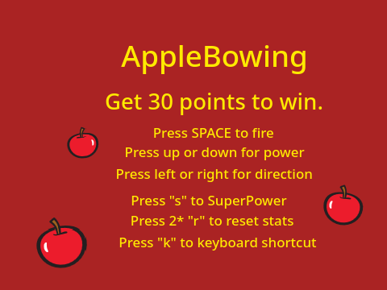
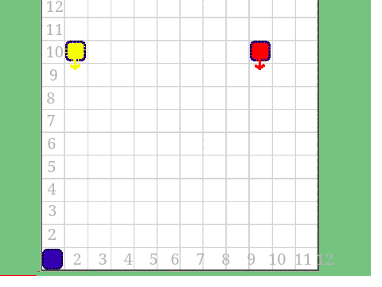

# scratch-games
Two easy Scratch games I made in 2024 for passing CS50x Week 0.

## AppleBowing
- The gole is to hit 30 red apples.
- Game has 3 levels and increasing difficulity.
- Sometimes you can use SuperPower :)

Try it: **🕹️ [PLAY GAME](https://scratch.mit.edu/projects/978293695)**
 
 

---

## ColorSquares
It's a game of tag where two computer players are following you and you've to run.

**🕹️ [PLAY GAME](https://scratch.mit.edu/projects/994538191)**
 
 

